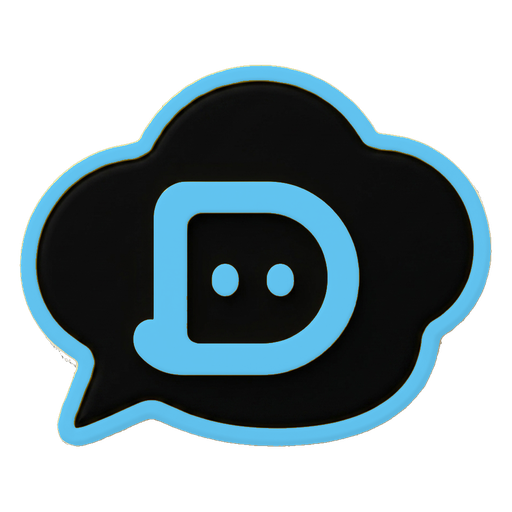

#  덕장이

> 웹과 카카오톡에서 동작하는 교내 장학금 안내 챗봇입니다.<br>
> 사용자의 자연어 질문을 LLM으로 처리해 답변합니다.

<br>

LLM 기반의 웹 챗봇을 새롭게 개발하면서, 2022년 개설한 채널 '덕장이' 카카오톡 챗봇도 함께 재구축하고 있습니다.<br>
프로젝트 배경 및 실제 운영 이력은 [프로젝트 소개](https://dukjangi.notion.site/)에서 확인 가능합니다.
<br><br>

## 📍 목차

- [아키텍처](#architecture)
- [기술 스택](#stack)
- [프로젝트 구조](#structure)
- [코드 품질](#quality)

---

<div id="architecture"></div>

## 🏹 아키텍처

LLM 호출 로직은 한 곳(`lib/llm`)에 모으고, 웹과 카카오톡은 엔드포인트만 다르게 둡니다. 두 채널이 동일한 응답 로직을 공유하는 구조입니다.

```
[웹 사용자]   → 웹 채팅 UI   → /api/chat         ┐
                                                ├→ lib/llm → 답변
[카톡 사용자] → 카카오톡 채널 → /api/kakao/skill ┘
```

오픈빌더의 폴백 블록을 스킬(웹훅)에 연결해, 등록되지 않은 질문까지 모두 서버를 거쳐 LLM으로 전달합니다.

<br>

<div id="stack"></div>

## 🔧 기술 스택

| Category         | Tech                                    |
| :--------------- | :-------------------------------------- |
| **Framework**    | Next.js (App Router)                    |
| **Language**     | TypeScript                              |
| **Web UI**       | React · Tailwind CSS                    |
| **LLM**          | LLM API (`@anthropic-ai/sdk`)           |
| **Kakao**        | Kakao i OpenBuilder (Skill + Callback)  |
| **Code Quality** | ESLint, Husky (lint-staged), commitlint |

<br>

<div id="structure"></div>

## 🗂️ 프로젝트 구조

```
app/
├─ page.tsx        # 웹 채팅 화면
└─ api/            # 엔드포인트 — 웹(/chat) · 카톡(/kakao/skill)
lib/
├─ llm.ts          # LLM 호출 (웹·카톡 공용)
├─ persona.ts      # 성격·말투
└─ kakao.ts        # 카카오 요청/응답 처리
```

<br>

<div id="quality"></div>

## ⚡ 코드 품질

Husky + lint-staged + commitlint로 커밋 전 검사를 자동화했습니다.

- `*.{ts,tsx,js,jsx}`: ESLint(`--fix`)
- 커밋 메시지: commitlint (Conventional Commits)
